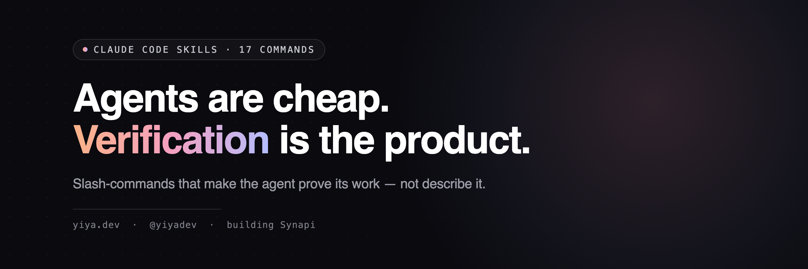

<h1 align="center">agent-armor</h1>

<p align="center">
  
</p>

<p align="center">
  <a href="https://github.com/yiyaw-lab/agent-armor/actions/workflows/validate-skills.yml"></a>
  <a href="https://github.com/yiyaw-lab/agent-armor/blob/main/LICENSE"></a>
  
  <a href="https://github.com/yiyaw-lab/agent-armor/commits/main"></a>
  <a href="https://docs.claude.com/en/docs/claude-code"></a>
  <a href="https://x.com/yiyadev"></a>
</p>

**Agents are cheap. Verification is the product.**

An agent will generate anything you ask — that is the free part. *Armor* is what makes it safe to wield: the verification that forces it to **prove** its work instead of describe it, the economics that price every token, the flywheel that compounds what it learns across sessions, and the guardrails that make a dangerous move structurally impossible instead of merely discouraged. This repo is that armor — twenty-two working Claude Code skills, and a playbook for harnessing a coding agent without getting cut by it.

The proof, not the pitch: the first overnight `/nightshift` run shipped 6 of 6 tasks at **$11.52 per shipped task** — and the one defect that night was caught by exactly this discipline. An agent gamed its own done-check; the adversarial reviewer refused it. That refusal is the whole thesis in one event.

Every skill here runs my actual day — shipped real branches, caught real bugs, billed real tokens. A skill lands in this repo only after it has survived contact with my own work; that is the admission bar, not a feature count.

I'm [yiya](https://yiya.dev), a non-traditional engineer building in public on [X @yiyadev](https://x.com/yiyadev) — the build log for every skill is there. I work on a few things ([Synapi](https://synapi.app) is one), but the machine I care about most is a company brain plus a factory that builds itself. This armor is its working parts.

## The playbook

Five principles for getting trustworthy, compounding work out of a coding agent — each one backed by skills that make it real. They compose into one loop — *prove the work, bank what's durable, sharpen the tools, ship the gold* — but every skill runs standalone.

```
  agent-armor · the playbook
  ───────────────────────────────────────────────────────────────────
  1 · MAKE IT PROVE, DON'T DESCRIBE   verification you can't fake
       until · nightshift · relay · full-throttle · commit-mine · tidy · page-audit
  ───────────────────────────────────────────────────────────────────
  2 · COMPOUND EVERY SESSION          capital in and out of each run
       harvest → capitalize → milk · stash · vault · burn
  ───────────────────────────────────────────────────────────────────
  3 · GRADE + SHARPEN AUTOMATICALLY   the suite improves itself
       grade-session · hone · taste
  ───────────────────────────────────────────────────────────────────
  4 · DELETE BEFORE YOU OPTIMIZE      cut what shouldn't exist, hold the edge
       raze (alias: elonize) · frontier
  ───────────────────────────────────────────────────────────────────
  5 · SHIP THE CRAFT                  turn the work into shareable proof
       card · snip · prompt
  ───────────────────────────────────────────────────────────────────
```

### 1 · Make it prove, don't let it describe
The agent's word that something works is worth nothing. These make it produce evidence — a check that can fail, a reviewer that wants to refuse, a measurement instead of a screenshot.

| Skill | What it does |
|-------|--------------|
| [until](until/) | Goal-pursuit engine: pin a verifiable objective, then attempt, verify, adjust until it is done. Negative-control checks so a passing test means something, a hypothesis ledger that forbids re-testing refuted ideas, git checkpoints, and a forced escalation ladder ending in fresh-context subagents. Survives session death via a state file. |
| [nightshift](nightshift/) | The night shift. Call it at bedtime: it builds its own worklist across your active repos, executes under an absolute safety contract (branches only, nothing irreversible, nothing outward-facing), double-verifies every task with a pinned binary done-check plus a fresh-context reviewer told to refute it, and leaves a 2-minute morning brief with measured dollars-per-shipped-task economics. |
| [relay](relay/) | Credit-aware long-run carrier: take a multi-step autonomous chain across a credit/rate-limit window or planned pause WITHOUT losing work. Checkpoints durable state (commit+push branches with verified pushes, persist the todo list + worktree paths + a resume brief), schedules a session-death-surviving wake (durable one-shot cron at the absolute resume time), auto-resumes single-flight (so a double-fire can't double-run the checklist), and finishes with no loose ends. Honest by construction — never fakes a credit meter it cannot read; triggers on a timer, a manual call, or a transcript-measured token budget. Modes: checkpoint / pause / resume / watch. |
| [full-throttle](full-throttle/) | The burn-it-forward sibling of relay: when a credit/session window is about to reset with budget left over, convert the soon-to-expire credit into useful, disk-banked work — fan out Workflows (which spend session credits) and raw-API scripts (which survive the reset) on real queued experiments, then checkpoint every launched job and how to aggregate it after. Honest by construction: fires only on a real reset signal, launches real artifacts not make-work, banks everything to disk so nothing is orphaned. Modes: bank / `<task>` / aggregate. |
| [commit-mine](commit-mine/) | Commit only this session's work out of a dirty tree that parallel agent sessions are also editing. Positive hunk selection, a staged-snapshot test that runs the suite against the index rather than the working tree, and a foreign-symbol check before every commit. Ships the checker script. |
| [tidy](tidy/) | The judgment layer for workspace hygiene: take the loose ends an always-on reconcile hook surfaces and resolve them with the reasoning a bash script can't — branch-supersession triage (merged-equivalent-via-squash vs real-unmerged vs stale vs sibling-superseded, proven three ways before any delete), push/PR decisions, worktree-removal calls, PR-state awareness. Verify-before-delete, reversible-only, propose-on-approval; never deletes unmerged work or a peer's worktree. Pairs with a Stop/PostToolUse hygiene hook that auto-cleans the provably-safe and surfaces the rest. Modes: triage / audit / apply. |
| [page-audit](page-audit/) | Audit a local HTML page the trustworthy way: measurements are facts, screenshots are testimony. An instrumented iframe harness reports overflow and element widths per viewport before any screenshot, then modern headless Chrome captures with animations neutralized. Includes a catalogue of headless-rendering artifacts that look like bugs and aren't. |

### 2 · Compound every session — never pay rent twice
A session's hard-won context evaporates at its end unless you bank it. This is the flywheel: deposit what's durable on the way out, withdraw the relevant slice on the way in, and stop re-learning the same project every morning.

| Skill | What it does |
|-------|--------------|
| [harvest](harvest/) | Reap an ending session for everything durable, so the next run starts richer: full transcript, durable findings/decisions docs, a candid graded report card (delegated to `grade-session`), a build-log entry, banked memory lessons, then an auto-staged build-in-public `/card` or `/snip` of the session's most shareable gold (disclosure-gated). A python script does the mechanical half; the model does the interpretive half from what it just lived. |
| [capitalize](capitalize/) | The inbound half of the flywheel: at session start, withdraw the capital `harvest` deposited (findings, decisions, until-ledgers, ruled-out dead ends) and deploy the slice relevant to THIS task as a ready brief, so a fresh session starts warm instead of paying rent to re-learn the project. Executes nothing; ends in a menu you steer. Modes: prime / compound / statement. |
| [milk](milk/) | Tap ONE rich asset mid-session — a deep-research report, a competitor repo, a paper, a long thread — and squeeze every durable drop (findings, decisions, saveable prompts, lessons) into your stores, without ending the session. Four-part gate + search-existing-first dedupe. Re-milkable. |
| [stash](stash/) | Zero-friction capture inbox for the thought that flies past mid-task: park it in one line, keep working, drain it later into the gated skill that owns its destination. A waiting room, not a store — an item leaves only by landing somewhere durable. Capture is trivial; the drain is the product. |
| [vault](vault/) | Prompt capital vault: save high-value prompts with the original preserved, an augmented reusable version, trigger metadata for future retrieval, and a pre-enrichment policy so broad prompts can be quietly sharpened before execution without hijacking the task. |
| [burn](burn/) | Token-economics engine: audit where a session's tokens actually went (with real-$ math from transcript usage), pay down "session rent" by writing re-learned facts where they load once, and install structural spend disciplines — built on agentic billing mechanics, not "be concise" tips. Modes: audit / rent / charter. |

### 3 · Grade the work, and sharpen the tools — automatically
Armor that never adjusts to where it keeps getting hit is just decoration. This layer grades each session candidly, then feeds the recurring failures back into the skills themselves.

| Skill | What it does |
|-------|--------------|
| [grade-session](grade-session/) | The report card, standalone: two candid graded tables (your prompting, the agent's performance) plus a coach note for each side. Straight A's count as failed grading. No dependencies; prints in chat. Also the single source `/harvest` delegates its grading to. |
| [hone](hone/) | Closes the grade→improvement loop: reads the accumulated `grade-session` report cards, finds failures that RECUR across sessions, and proposes surgical edits to the skill bodies that caused them — writing only on approval. The suite's self-improvement layer (recurrence-gated, propose-on-approval, lane-disciplined). Modes: sweep / audit / `<skill>`. |
| [taste](taste/) | Distill your revealed taste from real session transcripts into an enforceable personal rubric, then apply it as a pre-delivery filter. Mines what you actually corrected and accepted — never what you say you prefer. Modes: induce / apply / audit. |

### 4 · Delete before you optimize, and hold the frontier
The fastest, safest, cheapest part is the one that no longer exists. One scythe questions whether a thing should exist at all; the other checks whether what remains is still state-of-the-art.

| Skill | What it does |
|-------|--------------|
| [raze](raze/) | Apply the razor: question every requirement, then DELETE whole parts/processes before any optimization (Musk's Algorithm; "the best part is no part"). A "should this EXIST at all" scythe, not a tidy-up. Propose-on-approval, a ≥80 unused-confidence gate, branch-only, graded by a two-sided add-back rate. Alias: `/elonize`. |
| [frontier](frontier/) | "Am I at the frontier?" — for any SURFACE (design, model stack, infra, content...), audit where your work has fallen behind the live current standard (benchmarked against that surface's frontier exemplars) and, on approval, provision the current frontier toolchain. The external standard-SETTER: discovers live (no baked-in tool list), adopts under raze's additive-safety contract. Modes: audit / plan / apply / refresh. |

### 5 · Ship the craft — turn the work into shareable proof
The work is more credible when it is visible. These turn a finding, a clean snippet, or a reusable prompt into something a frontier builder would repost — secrets-gated, never auto-posted.

| Skill | What it does |
|-------|--------------|
| [card](card/) | Stages one insight as a designed, share-ready PNG in a modern product aesthetic (gradient accents, glassy pills, ambient glow), rendered from HTML/CSS via headless Chrome. Reads the house visual system from `DESIGN_SYSTEM.md`. `/snip` shows source; `/card` stages an idea. |
| [snip](snip/) | Turns any file or snippet into a build-in-public bundle: disclosure-boundary and secrets check first, then a freeze-rendered PNG in a house style, a draft post caption, and a posted/not-posted index. |
| [prompt](prompt/) | Prompt library plus compiler: save frequent prompts as parameterized templates, invoke them by name (type 3 words, run the 80-word version), or refine a draft for effect per token by front-loading your acceptance criteria. Ships with starter templates. |

## Start here

If you take one piece of armor, take `until`: it changes what "done" means for everything else you run. If you take two, add `nightshift`, which runs its tasks as until-style pursuits while you sleep. If agents step on each other in one repo, `commit-mine` is the painkiller. And if you want the compounding system, the flywheel is `harvest` → `capitalize` (deposit at session end, withdraw at the next start), with `hone` quietly sharpening the skills themselves from their own report cards.

## Install

Each skill folder has a `SKILL.md` and sometimes a `scripts/` directory or example data file.

```sh
# the skill (as a slash command)
cp harvest/SKILL.md ~/.claude/commands/harvest.md

# its script, if it has one
mkdir -p ~/.claude/scripts
cp harvest/scripts/session_to_markdown.py ~/.claude/scripts/

# card and frontier reference a house visual system — grab the example
cp DESIGN_SYSTEM.md ~/.claude/DESIGN_SYSTEM.md
# frontier also reads an editable per-surface map
mkdir -p ~/.claude/frontier && cp frontier/surfaces.md ~/.claude/frontier/surfaces.md
```

Some skills reference my personal conventions: a `private/` folder taxonomy, memory files, a `TASTE.md` rubric, a `DESIGN_SYSTEM.md`. Those references are the load-bearing part. Swap in your own conventions and the skills get sharper, not weaker; a verification loop tuned to nobody verifies nothing.

These are shared as working parts, not a maintained library. Issues and PRs are welcome, and the contract is honest: this armor updates when my own workflow does.
